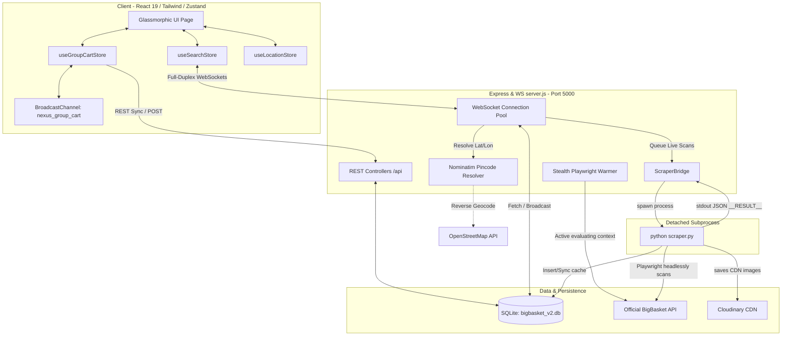
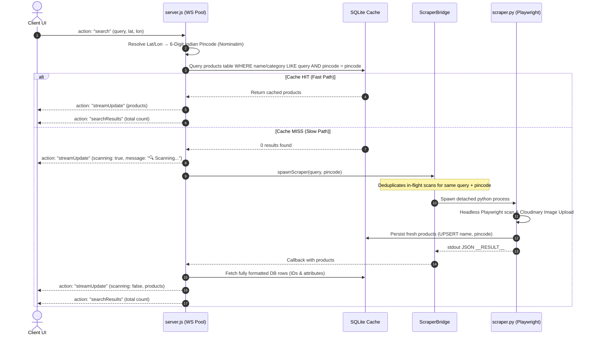

# ⚡ NEXUS V2 - Hyperlocal Delivery Aggregator

NEXUS V2 is a premium, state-of-the-art quick-commerce delivery aggregator that unifies shopping across major quick-commerce platforms like **BigBasket**, **Zepto**, and **Instamart**. 

By leveraging high-speed direct API communication, an active Playwright background scraper pipeline, and real-time WebSocket syncing, NEXUS V2 aggregates live inventory, pricing, and delivery estimates tailored to the user's micro-location.

---

## 📐 System Architecture

The following diagram illustrates how the frontend React client, the Zustand state stores, the Express/WebSocket server, the local SQLite database, the Nominatim geocoder, and the background Playwright scrapers interact:



---

## ✨ Core Features & Technical Walkthrough

### 1. 📡 Full-Duplex WebSockets ("Warp Pool")
Rather than utilizing traditional HTTP polling that creates overhead, NEXUS V2 leverages a persistent full-duplex WebSocket connection between the React client and the backend server.
- **Connection Handlers**: The client [useSearchStore.js](file:///d:/CODES/NEXUS-V2/frontend/src/store/useSearchStore.js) opens the connection, listens for stream updates, and routes single-shot responses to promise-based API callbacks in [bigbasketApi.js](file:///d:/CODES/NEXUS-V2/frontend/src/services/bigbasketApi.js).
- **Graceful Recovery**: Incorporates a built-in reconnect loop with a 3-second automatic back-off timer to handle local network drops or backend service restarts seamlessly.

### 2. ⚡ The Dual-Path Search Pipeline
When a user inputs a query, NEXUS V2 triggers a sophisticated dual-path pipeline designed to maximize performance while ensuring inventory freshness:



- **Pincode Resolution**: Outgoing queries enrich requests with the current coordinates (`lat`/`lon`) tracked in [useLocationStore.js](file:///d:/CODES/NEXUS-V2/frontend/src/store/useLocationStore.js). The server translates these into a 6-digit Indian postcode via OpenStreetMap's Nominatim Reverse Geocoder, caching results in-process.
- **Thundering Herd Mitigation**: To prevent CPU exhaustion under high concurrency, [scraperBridge.js](file:///d:/CODES/NEXUS-V2/backend/services/scraperBridge.js) uses an in-memory deduplication map `_inProgress`. If multiple clients search for `"milk"` at postcode `560034` simultaneously, a single Python process is shared, and all matching clients are resolved concurrently when done.

### 3. 👥 Collaborative GroupCart Synchronization
NEXUS V2 features collaborative, real-time shared shopping baskets.
- **Session Join**: Hosts create groups generating a 6-character alphanumeric share code (e.g. `H9X4P7`). Other users join by entering the code.
- **Tracking & Attribution**: Every cart item stores the member's profile who added the item (`addedBy`) and the timestamp (`addedAt`), which dynamically shows inside the joint shopping cart view.
- **Cross-Tab Synchronization**: Frontend uses a HTML5 `BroadcastChannel` (`nexus_group_cart`) to synchronize shopping states across all browser windows locally, while using WebSocket broadcasts to instantly keep remote users in sync.

### 4. 🗄️ Relational SQLite Engine
MongoDB has been fully migrated to SQLite for lightweight, atomic local caching.
- **Configured WAL Mode**: [sqlite.js](file:///d:/CODES/NEXUS-V2/backend/config/sqlite.js) initializes `better-sqlite3` and enforces WAL (Write-Ahead Logging) mode, delivering lightning-fast concurrent read/write transactions.
- **Tables**:
  - `users`: Standard schema for local customer registration and sessions.
  - `purchases`: Purchase history and status tracks.
  - `group_carts`: Persistent storage for active collaborative baskets.
  - `products`: Product catalogs populated dynamically by seeders or the Playwright scraper, with unique constraints on `(name, pincode)`.

---

## 📂 Project Structure

```text
NEXUS-V2/
├── backend/                        # Node.js & Express server
│   ├── config/                     
│   │   ├── db.js                   # Legacy MongoDB (Disabled)
│   │   └── sqlite.js               # Relational SQLite initialization (WAL mode)
│   ├── controllers/                
│   │   └── productController.js    # Local product catalog controllers
│   ├── extractors/                 # Fallback scraping configurations
│   ├── lib/                        
│   │   ├── launchBrowser.js        # Chromium launcher
│   │   ├── quickCommerce.js        # Dedicated QuickCommerce utilities
│   │   ├── resolveChromiumExecutable.js
│   │   └── searchCache.js          # In-memory search cache TTL limits
│   ├── models/                     
│   │   └── Product.js              # Legacy product model definitions
│   ├── routes/                     
│   │   ├── authRoutes.js           # Auth REST endpoints
│   │   ├── groupCartRoutes.js      # Collaborative Cart REST endpoints
│   │   └── productRoutes.js        # Product catalog routes
│   ├── scripts/                    
│   │   └── seedProducts.js         # Core database seeder script
│   ├── services/                   
│   │   ├── bigbasket.js              # Direct API evaluated evaluate contexts
│   │   └── scraperBridge.js        # Subprocess spawners & thundering herd mitigations
│   ├── scraper.py                  # Highly optimized python Playwright scraper
│   ├── proxies.txt                 # Optional list of routing proxies
│   └── server.js                   # Main application entry point & WebSocket pool
│
├── frontend/                       # React 19 Frontend App
│   ├── public/                     
│   └── src/                        
│       ├── components/             
│       │   ├── layout/             
│       │   │   ├── AuthModal.jsx      # Login and authentication overlay
│       │   │   ├── CartDrawer.jsx     # Individual slider cart
│       │   │   ├── LocationModal.jsx  # Micro-location geolocation modal
│       │   │   └── Navbar.jsx         # Sleek glassmorphic navigation header
│       │   └── product/            
│       │       └── ProductCard.jsx    # Premium HSL themed cards with buy triggers
│       ├── config/                 
│       │   └── activeSources.js       # Source configs (currently BigBasket only)
│       ├── hooks/                  # Zustand-to-React custom binding hooks
│       ├── pages/                  
│       │   ├── GroupCart.jsx          # Alphanumeric collaborative cart page
│       │   ├── Home.jsx               # Featured banners and active categories
│       │   ├── Profile.jsx            # User settings & order history
│       │   └── SearchResults.jsx      # Streaming results with scanning states
│       ├── services/               
│       │   └── bigbasketApi.js          # WS Promise-based wrappers
│       └── store/                  
│           ├── useAuthStore.js        # Local customer logins
│           ├── useCartStore.js        # Individual local cart state
│           ├── useGroupCartStore.js   # Collaborative shopping sessions
│           ├── useLocationStore.js    # Micro-location and geocoding coordinates
│           └── useSearchStore.js      # Main WS search and streaming store
```

---

## 🚦 Getting Started

### 1. Prerequisites
- **Node.js**: v18 or later
- **Python**: v3.10+ (for background scrapers)
- **Playwright**: Installed both on Node & Python

### 2. Project Installation
Clone the repository and install all dependencies:

```bash
# ── Setup Backend ──
cd backend
npm install
pip install playwright cloudinary python-dotenv
playwright install chromium

# ── Setup Frontend ──
cd ../frontend
npm install
```

### 3. Environment Configurations
Create `.env` files in both directories based on the templates:

**Backend (`backend/.env`):**
```ini
PORT=5000
DEFAULT_PINCODE=560034
DB_PATH=bigbasket_v2.db
USE_PROXIES=false

# Optional Cloudinary CDN Configuration for product images
CLOUDINARY_CLOUD_NAME=your-cloud-name
CLOUDINARY_API_KEY=your-api-key
CLOUDINARY_API_SECRET=your-api-secret
```

**Frontend (`frontend/.env`):**
```ini
# WebSocket back-end connection URL
VITE_WS_URL=ws://localhost:5000
```

### 4. Seeding the Database
To populate your SQLite database with default categories and mock products, run the seeder script:

```bash
cd backend
node scripts/seedProducts.js
```

### 5. Running the Application
Spin up both the backend and frontend servers in separate shells:

```bash
# Terminal 1: Backend Server
cd backend
node server.js

# Terminal 2: Frontend Client
cd frontend
npm run dev
```

The web application will be accessible at [http://localhost:5173](http://localhost:5173).

---

## 🛡️ License

Proprietary — Developed for internal use by the Antigravity AI team. All rights reserved.
